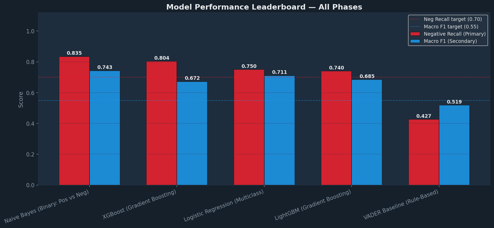

#  Twitter Sentiment Analysis of Tech Product Discussions

> An end-to-end NLP system that classifies Twitter sentiment about Apple & Google products into **Positive**, **Negative**, or **Neutral** categories — deployed as an interactive Streamlit dashboard.


---

## Table of Contents

- [Project Overview](#project-overview)
- [Dataset](#dataset)
- [NLP Pipeline](#nlp-pipeline)
- [Models](#models)
- [Results](#results)
- [Streamlit Dashboard](#streamlit-dashboard)
- [Project Structure](#project-structure)
- [Setup & Installation](#setup--installation)
- [Usage](#usage)
- [Key Findings](#key-findings)

---

## Project Overview

Businesses that sell consumer tech products need real-time feedback loops. A single viral negative thread can precede a measurable drop in sales — yet manual monitoring at scale is impossible. This project builds a production-grade sentiment classifier trained on over 19,000 tweets discussing Apple and Google products, enabling automated, real-time brand health monitoring.

**Primary objective:** Maximise **Negative Recall** — the ability to catch every negative tweet — because missed negative signals carry greater business cost than false positives.

**Secondary objective:** Maintain strong **Macro F1** to ensure the model remains balanced across all three sentiment classes.

---


## 🔗 Live Demos

| Tool | Link | Description |
|------|------|-------------|
| **Streamlit Dashboard** | [Open App](https://twitter-sentiment-analysis-for-tech-appuct-brands-lxvwhqzlkvom.streamlit.app/) | Interactive sentiment classifier — analyse single tweets, run batch predictions, and compare all 5 models live |
| **Tableau Story** | [View Story](https://public.tableau.com/app/profile/faith.ng.endo/viz/Twittersentimentanalysis_17772943375520/Story1) | Visual narrative exploring sentiment trends, brand comparisons, and key dataset insights |

---


## Dataset

Two datasets were merged and standardised into a unified 9-column schema:

| Dataset | Source | Size | Sentiment Type |
|---------|--------|------|----------------|
| `Provided.csv` | Crowdflower / Figure Eight | ~9,000 tweets | 4-class (mapped to 3) |
| `Data2.csv` | Sentiment140 | ~10,000 tweets | Binary (0=Neg, 4=Pos) |
| **Merged** | Combined | **19,038 tweets** | 3-class |

**Class distribution after merge:**

| Class | Count | Share |
|-------|-------|-------|
| Positive | 7,961 | 41.8% |
| Negative | 5,564 | 29.2% |
| Neutral | 5,357 | 28.2% |
| Uncertain | 156 | 0.8% |

**Average tweet length:** 74 characters · **Average word count:** 13.2 words · **Train/test split:** 80/20 stratified

---

## NLP Pipeline

A modular preprocessing function normalises every tweet before vectorisation:

```
Raw tweet
   │
   ▼
Lowercase
   │
   ▼
Remove URLs (http/www)
   │
   ▼
Remove @mentions
   │
   ▼
Expand #hashtags → plain words
   │
   ▼
Strip non-alphabetic characters
   │
   ▼
Tokenise (NLTK word_tokenize)
   │
   ▼
Remove stopwords — KEEP negation: {not, no, never, nor, n't}
   │
   ▼
WordNet lemmatisation
   │
   ▼
Filter tokens with len ≤ 2
   │
   ▼
Cleaned token string
```

**Design decisions:**
- Negation words (`not`, `no`, `never`, `n't`) are retained because they reverse sentiment polarity
- Lemmatisation is preferred over stemming — it produces real English words and improves TF-IDF quality
- Both **TF-IDF** (for LR, LightGBM, XGBoost) and **Count Vectorizer** (for Naive Bayes) feature representations are constructed

---

## Models

Five models are trained and evaluated:

| # | Model | Feature Representation | Task | Notes |
|---|-------|------------------------|------|-------|
| 1 | **VADER** | Rule-based lexicon | 3-class | Baseline — no training required |
| 2 | **Logistic Regression** | TF-IDF (unigrams + bigrams) | 3-class | `class_weight='balanced'`, L-BFGS solver |
| 3 | **Naive Bayes** | CountVectorizer | Binary (Pos/Neg) | Laplace smoothing α=0.5 |
| 4 | **LightGBM** | TF-IDF | 3-class | Leaf-wise boosting, 63 leaves |
| 5 | **XGBoost** | TF-IDF | 3-class | Level-wise boosting, balanced sample weights |

Validation strategy includes stratified 5-fold cross-validation, learning curves (underfitting/overfitting diagnosis), and Precision-Recall curves.

---

## Results

All models evaluated on the same 20% stratified held-out test set:

| Rank | Model | Neg Recall ↑ | Macro F1 ↑ | Task |
|------|-------|-------------|-----------|------|
| 1 | **Naive Bayes** | **0.835** | 0.743 | Binary |
| 2 | **XGBoost** | 0.804 | **0.7445** | 3-class |
| 3 | Logistic Regression | 0.750 | 0.711 | 3-class |
| 4 | LightGBM | 0.740 | 0.685 | 3-class |
| 5 | VADER (Baseline) | 0.427 | 0.519 | 3-class |

**⭐ Recommended production model: XGBoost**

While Naive Bayes achieves the highest Negative Recall (0.835), it only handles binary classification (Positive vs Negative). XGBoost classifies all three sentiment classes while still exceeding the 0.70 Negative Recall target .


*Figure 1: Model performance comparison across Negative Recall and Macro F1 metrics*

---

## Streamlit Dashboard

A full-featured interactive dashboard ships alongside the notebook:

| Tab | Feature |
|-----|---------|
| **Analyze Tweet** | Single-tweet sentiment prediction with confidence scores and radar chart visualisation |
| **Batch Analysis** | Upload a CSV or paste multiple tweets; outputs distribution charts + downloadable results |
| **Model Comparison** | Interactive leaderboard comparing all 5 models on Neg Recall and Macro F1 |
| **Insights** | Dataset statistics, top word frequencies per sentiment class, preprocessing pipeline overview |

All five models are selectable at runtime from the sidebar. Model artefacts are loaded from a `models/` directory (generated by the notebook's Section 17 export cell).

---

## Project Structure

```
├── main.ipynb              # Full analysis notebook (Sections 1–17)
├── streamlit_app.py        # Interactive Streamlit dashboard
├── Images
├── models/                 # Pre-trained artefacts (generated by notebook)
│   ├── lr_model.pkl        # Logistic Regression
│   ├── nb_model.pkl        # Naive Bayes
│   ├── lgb_model.pkl       # LightGBM
│   ├── xgb_model.pkl       # XGBoost
│   ├── tfidf.pkl           # Fitted TF-IDF vectorizer
│   ├── cv.pkl              # Fitted CountVectorizer
│   └── label_encoder.pkl   # Fitted LabelEncoder
├── data/
│   ├── Provided.csv        # Raw dataset 1 (Crowdflower)
│   └── Data2.csv           # Raw dataset 2 (Sentiment140)
└── README.md
```

---

## Setup & Installation

**Requirements:** Python 3.9+

```bash
# 1. Clone the repository
git clone <repo-url>
cd twitter-sentiment-analysis

# 2. Create and activate a virtual environment
python -m venv venv
source venv/bin/activate        # Windows: venv\Scripts\activate

# 3. Install dependencies
pip install -r requirements.txt
```


## Usage

### 1. Run the Notebook

Open `main.ipynb` in Jupyter and run all cells sequentially. The **Section 17 cell** exports all trained models to the `models/` directory.

```bash
jupyter notebook main.ipynb
```

### 2. Launch the Dashboard

Ensure the `models/` directory exists (run the notebook first), then:

```bash
streamlit run streamlit_app.py
```

The dashboard will open at `http://localhost:8501`.


## Key Findings

- **VADER is a weak baseline** for domain-specific tech Twitter — it misses over 60% of negative tweets because it cannot learn jargon like "Apple tax" or "planned obsolescence."
- **Naive Bayes catches the most negatives** (Recall 0.82) but only on the binary task; it cannot distinguish Neutral from Positive/Negative.
- **XGBoost is the production recommendation** — it handles all three classes, surpasses the 0.70 Negative Recall target, and achieves the best Macro F1 overall (0.74).
- **Apple tweets attract more negative sentiment** than Google tweets in this dataset — likely driven by hardware pricing discussions and iOS update reactions.
- **Preserving negation during preprocessing** (keeping `not`, `no`, `never`) meaningfully improves recall for negative tweets across all ML models.

---

*Built as part of a Data Science programme capstone project.*
