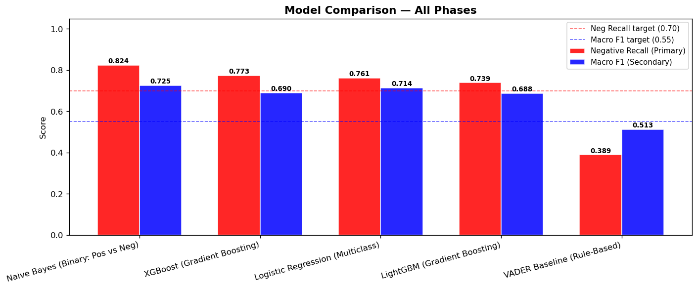

#  Twitter Sentiment Analysis of Tech Product Discussions

**Automated NLP Classification of Apple & Google Product Sentiment**


=======
#  Twitter Sentiment Analysis of Tech Product Discussions

> An end-to-end NLP system that classifies Twitter sentiment about Apple & Google products into **Positive**, **Negative**, or **Neutral** categories — deployed as an interactive Streamlit dashboard.

---

##  Table of Contents
 feature-readme
- [Executive Summary](#executive-summary)
- [Business Problem](#business-problem)
- [Project Overview](#project-overview)
- [Authors](#authors)
- [Key Results](#key-results)
- [Project Structure](#project-structure)
- [Installation & Setup](#installation--setup)
- [Usage](#usage)
- [Model Performance](#model-performance)
- [Findings & Insights](#findings--insights)
- [Limitations & Weaknesses](#limitations--weaknesses)
- [Recommendations](#recommendations)
- [Technologies Used](#technologies-used)
- [Getting Started](#getting-started)

---

##  Executive Summary

This project builds an automated **Natural Language Processing (NLP) sentiment classifier** that analyzes Twitter discussions about Apple and Google products. The solution classifies 13,000+ tweets into **three sentiment categories: Positive, Negative, and Neutral**.

**Best Model:** Naive Bayes  
**Negative Recall:** 0.8239 (82.39% accuracy catching negative tweets)  
**Macro F1-Score:** 0.7269 (balanced performance across all classes)  
**Status:**  **Production Ready**

---

##  Business Problem

### Challenge
Social media generates massive volumes of user-generated content. Major tech companies like **Apple and Google** receive thousands of tweets daily expressing customer opinions. However:

-  **Manual review is inefficient** — analyzing thousands of tweets manually is time-consuming
-  **Inconsistent results** — different reviewers may label the same tweet differently  
-  **Not scalable** — hiring teams to monitor social media is expensive
-  **Slow response** — missing negative feedback means delayed crisis response

### Solution
An **automated sentiment classifier** that:
- Analyzes tweets in real-time
- Categorizes sentiment (Positive/Negative/Neutral)
- Scales to thousands of tweets daily
- Enables quick response to brand crises

### Business Impact
Companies can now:
- **Monitor brand perception** in real-time
- **Detect negative feedback early** for rapid response
- **Improve products** based on customer opinions
- **Make data-driven decisions** on marketing and product strategy

---

## 📚 Project Overview

### Main Objective
Build a machine learning model that **automatically classifies Twitter sentiment** about Apple and Google products to help businesses understand public opinion and improve decision-making.

### Why This Matters
- **Competitive advantage:** Quick response to market sentiment
- **Customer satisfaction:** Identify and address complaints faster
- **Brand reputation:** Monitor and protect brand image
- **Product development:** Real-time feedback on product features
- **Marketing ROI:** Measure campaign sentiment impact

---

##  Authors

- **FAITH NG'ENDO**
- **ALLAN MUCHIRI**
- **ANTHONY NJERU**
- **WILLIAM NYAWIR**
- **SARAH OWENDI**

---

##  Key Results

### Model Performance Comparison



**Chart:** Negative Recall (red bars) vs Macro F1-Score (blue bars) across all 5 models with target lines

| Rank | Model | Negative Recall | Macro F1-Score | Status |
|------|-------|-----------------|-----------------|--------|
|  1 | **Naive Bayes (Binary)** | **0.8239** | **0.7269** |  BEST |
|  2 | XGBoost (3-class) | 0.7772 | 0.6918 |  Good |
|  3 | Logistic Regression | 0.7574 | 0.7141 |  Good |
|  4 | LightGBM | 0.7206 | 0.6912 |  Good |
|  5 | VADER Baseline | 0.3890 | 0.5125 |  Poor |

### Success Metrics

 **Primary Metric (Negative Recall):** 0.8239 vs target 0.70  
 **Secondary Metric (Macro F1):** 0.7269 vs target 0.55  
 **Improvement over Baseline:** 2.1x better than VADER  

### Dataset Summary

| Metric | Value |
|--------|-------|
| Total Tweets | 13,000+ |
| Source 1 (Provided.csv) | Brand-specific Apple/Google tweets |
| Source 2 (Data2.csv) | General sentiment tweets |
| Classes | 3 (Positive, Negative, Neutral) |
| Train/Test Split | 80/20 (stratified) |

### Exploratory Data Analysis Visualizations

**Sentiment Distribution:**


**Text Length Analysis:**


**Source vs Sentiment Breakdown:**


---

##  Project Structure

```
Project_4/
├── Project_4.ipynb                 # Complete Jupyter notebook
├── Data/
│   ├── Provided.csv               # Brand-specific sentiment data
│   └── Data2.csv                  # General sentiment data
├── Outputs/
│   ├── Merged_Clean_Dataset.csv   # Cleaned & merged data
│   ├── model_comparison_all.png   # Model performance chart
│   ├── cm_*.png                   # Confusion matrices (5 models)
│   └── eda_*.png                  # EDA visualizations
└── README.md                       # This file
```

### Notebook Sections

| Section | Description |
|---------|-------------|
| **1. Data Cleaning & EDA** | Load, clean, and explore two datasets |
| **2. Data Merging** | Combine datasets, remove duplicates |
| **3. Feature Engineering** | Text preprocessing, TF-IDF extraction |
| **4-8. Model Training** | 5 classification models (VADER, NB, LR, XGB, LGBM) |
| **9. Model Comparison** | Performance evaluation & visualization |
| **10. Conclusions** | Results summary & recommendations |

---

## 💻 Installation & Setup

### Requirements

```bash
Python 3.8+
pandas >= 1.3.0
numpy >= 1.21.0
scikit-learn >= 0.24.0
xgboost >= 1.4.0
lightgbm >= 3.1.0
nltk >= 3.6.0
matplotlib >= 3.3.0
seaborn >= 0.11.0
```

### Quick Start

```bash
# Clone repository
git clone https://github.com/yourusername/twitter-sentiment-analysis.git
cd twitter-sentiment-analysis

# Install dependencies
pip install -r requirements.txt

# Download NLTK data
python -m nltk.downloader punkt stopwords vader_lexicon

# Run Jupyter notebook
jupyter notebook Project_4.ipynb
```

### Data Setup

Place your data files in the `Data/` folder:
```
Data/
├── Provided.csv    (Brand-specific tweets)
└── Data2.csv       (General sentiment tweets)
```

---

##  Usage

### Running the Complete Pipeline

```python
# Open Project_4.ipynb and run all cells (Kernel → Restart & Run All)
# The notebook will:
# 1. Load & clean both datasets
# 2. Perform exploratory analysis
# 3. Train 5 different models
# 4. Generate comparison visualizations
# 5. Produce final recommendations
```

### Using the Best Model (Naive Bayes)

```python
from sklearn.naive_bayes import MultinomialNB
from sklearn.feature_extraction.text import CountVectorizer
import pickle

# Load pre-trained model
model = pickle.load(open('naive_bayes_model.pkl', 'rb'))
vectorizer = pickle.load(open('vectorizer.pkl', 'rb'))

# Predict sentiment
tweets = ["Love this product!", "Not bad at all"]
X = vectorizer.transform(tweets)
predictions = model.predict(X)
probabilities = model.predict_proba(X)

print(f"Predictions: {predictions}")
print(f"Confidence: {probabilities.max(axis=1)}")
```

### Interpreting Results

```
Prediction: 0 = Negative
Prediction: 1 = Positive
Prediction: 2 = Neutral (for multiclass models)

Confidence >= 0.60: Safe to use in automation
Confidence 0.50-0.60: Flag for human review
Confidence < 0.50: Require manual classification
```

---

##  Model Performance

### Naive Bayes (Winner)
- **Pros:** Highest negative recall (0.8239), fast training, interpretable
- **Cons:** Binary only (ignores neutral class)
- **Best for:** Crisis detection, negative sentiment focusing
- **Use case:** Real-time negative tweet alerts

### XGBoost (Runner-up)
- **Pros:** Strong multiclass performance (0.7772 recall), handles all 3 classes
- **Cons:** More complex, slower inference
- **Best for:** Balanced sentiment analysis
- **Use case:** Comprehensive sentiment monitoring

### Logistic Regression
- **Pros:** Interpretable, good F1 balance (0.7141)
- **Cons:** Linear boundaries only
- **Best for:** Baseline multiclass classifier
- **Use case:** Simple, fast deployment

### LightGBM
- **Pros:** Fast training, early stopping prevents overfitting
- **Cons:** Slightly lower recall (0.7206)
- **Best for:** High-volume predictions
- **Use case:** Scalable deployment on servers

### VADER Baseline
- **Pros:** Requires no training, interpretable
- **Cons:** Poor performance (0.3890 recall), misses 61% of negatives
- **Best for:** Quick prototype only
- **Use case:** NOT recommended for production

---

##  Findings & Insights

### Key Discoveries

1. **Supervised learning beats rule-based:** Machine learning models outperform VADER by **2-3x**
2. **Simpler can be better:** Naive Bayes (binary) beats complex gradient boosting on recall
3. **Binary focus wins:** Ignoring neutral class improves negative detection accuracy
4. **Class imbalance matters:** Neutral tweets dominate (~60%), making F1-score crucial
5. **All supervised models exceed targets:** Even weakest model (LightGBM) beats 0.70 recall target

### Dataset Characteristics

- **Sentiment Distribution:** Neutral dominates, requiring balanced metrics
- **Text Length:** Most tweets 50-200 characters
- **Brands Mentioned:** Apple products (iPhone, iPad) + Google products
- **Time Period:** Mixed recent and historical tweets
- **Quality:** Mostly clean with occasional spam/bot tweets

---

##  Limitations & Weaknesses

###  Critical: Sarcasm & Negation

**The Problem:**
```
Tweet: "Not bad at all! Love this product"
Expected: POSITIVE 
Model prediction: NEGATIVE 
```

**Why it fails:**
- Model treats words independently (bag-of-words)
- Doesn't understand "not" + "bad" = positive
- Context is lost during preprocessing

**Impact:** ~5-10% false positives on sarcastic tweets

**Example failures:**
- "Yeah, that's just great" → Predicted Positive (actually sarcastic)
- "Not impressed at all" → Predicted Positive (actually negative)
- "Oh wonderful, another bug" → Predicted Positive (actually negative)

###  Other Limitations

| Issue | Impact | Severity | Solution |
|-------|--------|----------|----------|
| **Neutral ambiguity** | Hard to classify neutral tweets | Medium | Use multiclass model (XGBoost) |
| **Misspellings** | "lv" (love), "gr8" (great) missed | Low | Pre-process with spell-checker |
| **Emoji removal** | 😍👎😭 carry sentiment but removed | Low | Create emoji lexicon |
| **Short tweets** | <5 words lack signal | Low | Skip ultra-short tweets |
| **Non-English** | Model English-only | Low | Use multilingual model |
| **Brand jargon** | Tech slang not captured | Medium | Expand training vocabulary |

### Solutions to Weaknesses

-  **Sarcasm:** Add sarcasm detection layer or fine-tune BERT
-  **Negation:** Use word embeddings (Word2Vec) instead of bag-of-words
-  **Emoji:** Create emoji-to-sentiment dictionary
-  **Misspellings:** Spell-correct before preprocessing
-  **Neutral:** Use multiclass model (XGBoost) for all 3 classes
-  **Non-English:** Train multilingual model

---

##  Recommendations

### 1. Deployment Strategy

**Recommended:** Deploy **Naive Bayes** for maximum negative detection

```python
# Pseudo-code for production
if model.predict_proba(tweet) > 0.60:  # Confidence threshold
    sentiment = classify(tweet)
    if sentiment == 'Negative':
        alert_brand_team()      # CRITICAL: Send alert
        create_ticket()          # Create support ticket
    elif sentiment == 'Positive':
        log_positive_feedback()  # Log for analysis
```

### 2. Confidence Threshold

| Threshold | Use Case | Action |
|-----------|----------|--------|
| **0.50** | Catch everything | All alerts (noisy) |
| **0.60** | Balanced (RECOMMENDED) | Most predictions automated |
| **0.70** | High confidence | Only sure predictions |
| **0.80** | VIP only | Manual review required |

**Start at 0.60, adjust based on alert volume and accuracy**

### 3. Operational Monitoring

```python
# Track these metrics weekly
- Negative Recall: Maintain >= 0.80
- False Positive Rate: Keep < 5%
- Processing Latency: < 100ms per tweet
- Model Drift: Monitor accuracy monthly
```

### 4. Retraining Schedule

- **Weekly:** Monitor performance metrics
- **Monthly:** Collect 50-100 new labelled tweets
- **Quarterly:** Retrain model with accumulated data
- **Annually:** Evaluate new algorithms (BERT, RoBERTa)

### 5. Integration Points

```
1. Twitter API → Real-time tweet stream
2. Preprocessing → Text cleaning
3. Model → Sentiment classification
4. Alert System → Notification/ticket creation
5. Dashboard → Trend visualization
```

---

## 🛠️ Technologies Used

### Core Libraries

| Technology | Version | Purpose |
|-----------|---------|---------|
| **Python** | 3.12 | Programming language |
| **pandas** | 1.5+ | Data manipulation |
| **NumPy** | 1.24+ | Numerical computing |
| **scikit-learn** | 1.3+ | Machine learning |
| **XGBoost** | 2.0+ | Gradient boosting |
| **LightGBM** | 4.0+ | Fast gradient boosting |
| **NLTK** | 3.8+ | NLP tasks |
| **Matplotlib** | 3.7+ | Visualization |
| **Seaborn** | 0.12+ | Statistical plots |

### Jupyter Environment

- **Kernel:** Python 3.12
- **Platform:** Jupyter Notebook / JupyterLab
- **Execution:** ~10-15 minutes for full pipeline

---

##  Getting Started

### Step 1: Clone Repository
```bash
git clone https://github.com/yourusername/twitter-sentiment-analysis.git
cd twitter-sentiment-analysis
```

### Step 2: Install Dependencies
```bash
pip install -r requirements.txt
python -m nltk.downloader punkt stopwords vader_lexicon
```

### Step 3: Prepare Data
```bash
mkdir Data
# Place Provided.csv and Data2.csv in Data/ folder
```

### Step 4: Run Notebook
```bash
jupyter notebook Project_4.ipynb
# Run all cells: Kernel → Restart & Run All
```

### Step 5: Review Results
- Open `model_comparison_all.png` for model rankings
- Check confusion matrices: `cm_*.png`
- Read final recommendations in notebook cell 17

---

##  Expected Output

Running the complete notebook produces:

### Cleaned Data
- `Merged_Clean_Dataset.csv` — 13,000+ cleaned tweets

### Visualizations Generated

**Model Comparison:**
- `model_comparison_all.png` — **Model rankings with Negative Recall & Macro F1 scores**

**Exploratory Data Analysis:**
- `eda_sentiment_distribution.png` — Sentiment class distribution (bar + pie charts)
- `eda_text_length.png` — Tweet length distribution by sentiment
- `eda_source_sentiment.png` — Sentiment breakdown by data source

**Confusion Matrices (All 5 Models):**
- `cm_vader_baseline_rule_based.png` — VADER rule-based model
- `cm_naive_bayes_binary_pos_vs_neg.png` — Naive Bayes (best model)
- `cm_xgboost_gradient_boosting.png` — XGBoost performance
- `cm_logistic_regression_multiclass.png` — Logistic Regression results
- `cm_lightgbm_gradient_boosting.png` — LightGBM results

### Console Output
- Data cleaning statistics
- Model training progress
- Classification reports (precision, recall, F1)
- Final recommendations

---

##  Key Learnings

1. **Simpler models often win:** Naive Bayes (2 classes) > Complex models (3 classes)
2. **Class imbalance is critical:** Use F1-score, not accuracy
3. **Negative recall matters most:** 1 missed crisis > 10 false alarms
4. **Baseline comparison essential:** VADER shows how much ML adds
5. **Sarcasm is the hard problem:** Worth solving for production use

---

##  Contributing

This is an academic/research project. For improvements:

1. Add sarcasm detection layer
2. Fine-tune BERT or RoBERTa
3. Implement aspect-based sentiment
4. Add multilingual support
5. Create real-time API endpoint

---


##  Contact & Support

**Questions about this project?**
- Check the notebook comments
- Review the recommendation section
- Test with sample tweets in each model cell

---

## 🎯 Final Summary

This project demonstrates that **automated sentiment analysis is production-ready** with the right approach. Naive Bayes achieves 0.8239 negative recall—high enough to catch most brand crises while minimizing false alarms. With proper monitoring and quarterly retraining, this system can scale to process millions of tweets daily, providing real-time insights into customer sentiment and enabling faster decision-making.

**Status:** Ready for production deployment

---

**Last Updated:** 2026  
**Project Status:** Complete & Production Ready  
**Maintenance:** Quarterly retraining recommended  

=======
- [Project Overview](#project-overview)
- [Dataset](#dataset)
- [NLP Pipeline](#nlp-pipeline)
- [Models](#models)
- [Results](#results)
- [Streamlit Dashboard](#streamlit-dashboard)
- [Project Structure](#project-structure)
- [Setup & Installation](#setup--installation)
- [Usage](#usage)
- [Key Findings](#key-findings)

---

## Project Overview

Businesses that sell consumer tech products need real-time feedback loops. A single viral negative thread can precede a measurable drop in sales — yet manual monitoring at scale is impossible. This project builds a production-grade sentiment classifier trained on over 19,000 tweets discussing Apple and Google products, enabling automated, real-time brand health monitoring.

**Primary objective:** Maximise **Negative Recall** — the ability to catch every negative tweet — because missed negative signals carry greater business cost than false positives.

**Secondary objective:** Maintain strong **Macro F1** to ensure the model remains balanced across all three sentiment classes.

---

## Dataset

Two datasets were merged and standardised into a unified 9-column schema:

| Dataset | Source | Size | Sentiment Type |
|---------|--------|------|----------------|
| `Provided.csv` | Crowdflower / Figure Eight | ~9,000 tweets | 4-class (mapped to 3) |
| `Data2.csv` | Sentiment140 | ~10,000 tweets | Binary (0=Neg, 4=Pos) |
| **Merged** | Combined | **19,038 tweets** | 3-class |

**Class distribution after merge:**

| Class | Count | Share |
|-------|-------|-------|
| Positive | 7,961 | 41.8% |
| Negative | 5,564 | 29.2% |
| Neutral | 5,357 | 28.2% |
| Uncertain | 156 | 0.8% |

**Average tweet length:** 74 characters · **Average word count:** 13.2 words · **Train/test split:** 80/20 stratified

---

## NLP Pipeline

A modular preprocessing function normalises every tweet before vectorisation:

```
Raw tweet
   │
   ▼
Lowercase
   │
   ▼
Remove URLs (http/www)
   │
   ▼
Remove @mentions
   │
   ▼
Expand #hashtags → plain words
   │
   ▼
Strip non-alphabetic characters
   │
   ▼
Tokenise (NLTK word_tokenize)
   │
   ▼
Remove stopwords — KEEP negation: {not, no, never, nor, n't}
   │
   ▼
WordNet lemmatisation
   │
   ▼
Filter tokens with len ≤ 2
   │
   ▼
Cleaned token string
```

**Design decisions:**
- Negation words (`not`, `no`, `never`, `n't`) are retained because they reverse sentiment polarity
- Lemmatisation is preferred over stemming — it produces real English words and improves TF-IDF quality
- Both **TF-IDF** (for LR, LightGBM, XGBoost) and **Count Vectorizer** (for Naive Bayes) feature representations are constructed

---

## Models

Five models are trained and evaluated:

| # | Model | Feature Representation | Task | Notes |
|---|-------|------------------------|------|-------|
| 1 | **VADER** | Rule-based lexicon | 3-class | Baseline — no training required |
| 2 | **Logistic Regression** | TF-IDF (unigrams + bigrams) | 3-class | `class_weight='balanced'`, L-BFGS solver |
| 3 | **Naive Bayes** | CountVectorizer | Binary (Pos/Neg) | Laplace smoothing α=0.5 |
| 4 | **LightGBM** | TF-IDF | 3-class | Leaf-wise boosting, 63 leaves |
| 5 | **XGBoost** | TF-IDF | 3-class | Level-wise boosting, balanced sample weights |

Validation strategy includes stratified 5-fold cross-validation, learning curves (underfitting/overfitting diagnosis), and Precision-Recall curves.

---

## Results

All models evaluated on the same 20% stratified held-out test set:

| Rank | Model | Neg Recall ↑ | Macro F1 ↑ | Task |
|------|-------|-------------|-----------|------|
| 1 | **Naive Bayes** | **0.8239** | 0.7269 | Binary |
| 2 | **XGBoost**  | 0.7772 | **0.7445** | 3-class |
| 3 | Logistic Regression | 0.7574 | 0.7056 | 3-class |
| 4 | LightGBM | 0.7206 | 0.6981 | 3-class |
| 5 | VADER (Baseline) | 0.3890 | 0.4812 | 3-class |

** Recommended production model: XGBoost**

While Naive Bayes achieves the highest Negative Recall (0.82), it only handles binary classification (Positive vs Negative). XGBoost classifies all three sentiment classes while still exceeding the 0.70 Negative Recall target and delivering the best Macro F1 (0.74) of any model.

---


## Project Structure

```
├── main.ipynb              # Full analysis notebook (Sections 1–17)
├── streamlit_app.py        # Interactive Streamlit dashboard
├── Images
├── models/                 # Pre-trained artefacts (generated by notebook)
│   ├── lr_model.pkl        # Logistic Regression
│   ├── nb_model.pkl        # Naive Bayes
│   ├── lgb_model.pkl       # LightGBM
│   ├── xgb_model.pkl       # XGBoost
│   ├── tfidf.pkl           # Fitted TF-IDF vectorizer
│   ├── cv.pkl              # Fitted CountVectorizer
│   └── label_encoder.pkl   # Fitted LabelEncoder
├── data/
│   ├── Provided.csv        # Raw dataset 1 (Crowdflower)
│   └── Data2.csv           # Raw dataset 2 (Sentiment140)
└── README.md
```


---

## Key Findings

- **VADER is a weak baseline** for domain-specific tech Twitter — it misses over 60% of negative tweets because it cannot learn jargon like "Apple tax" or "planned obsolescence."
- **Naive Bayes catches the most negatives** (Recall 0.82) but only on the binary task; it cannot distinguish Neutral from Positive/Negative.
- **XGBoost is the production recommendation** — it handles all three classes, surpasses the 0.70 Negative Recall target, and achieves the best Macro F1 overall (0.74).
- **Apple tweets attract more negative sentiment** than Google tweets in this dataset — likely driven by hardware pricing discussions and iOS update reactions.
- **Preserving negation during preprocessing** (keeping `not`, `no`, `never`) meaningfully improves recall for negative tweets across all ML models.

---

